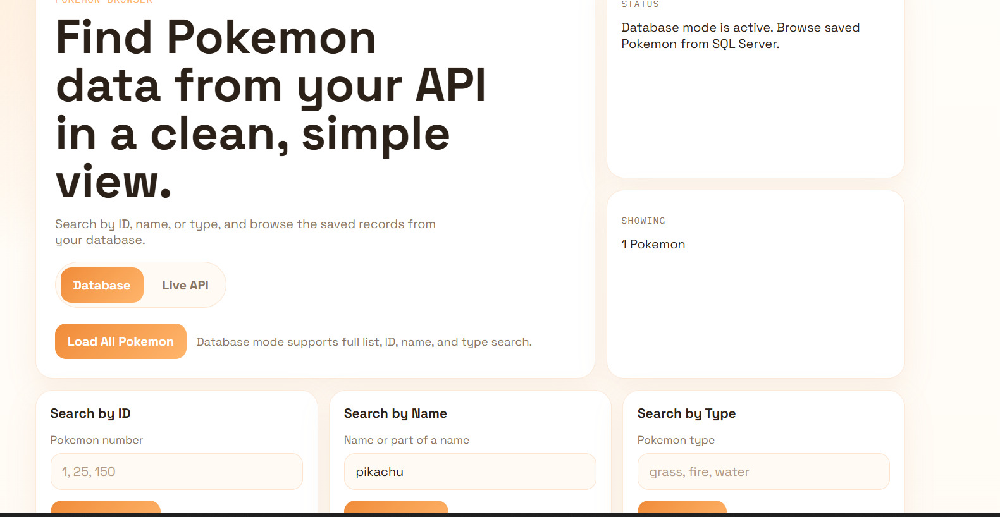
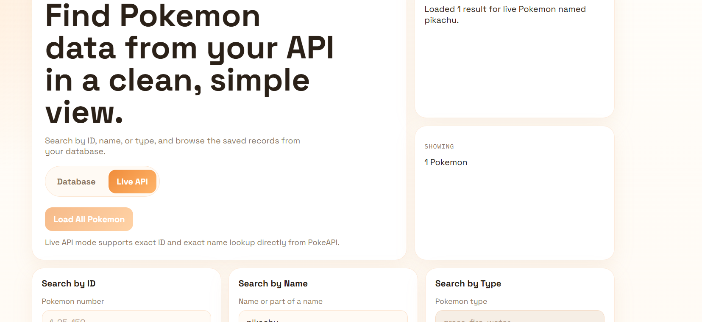

# PokéVault

A full-stack ETL + REST API project built around the [PokéAPI](https://pokeapi.co/). Extracts Pokémon data from an external API, loads it into a local SQL Server database, and serves it through a custom ASP.NET Core REST API — with a second live mode that bypasses the database and hits PokéAPI directly.

---

## Architecture

```
PokéAPI (external)
      │
      ▼
PokemonIngestion        ← ETL pipeline (C# console app)
  - Paginated fetch      fetches 100 Pokémon in batches of 20
  - Transform JSON       extracts id, name, height, weight, types, abilities
  - Load to SQL Server   via Entity Framework Core (batch upsert)
      │
      ▼
PokemonDB (SQL Server)
      │
      ▼
PokemonAPI              ← ASP.NET Core REST API
  - /api/pokemon                  → all Pokémon from DB
  - /api/pokemon/{id}             → by ID from DB
  - /api/pokemon/name/{name}      → by name (partial match) from DB
  - /api/pokemon/type/{type}      → by type from DB
  - /api/pokemon/live/{id}        → live from PokéAPI by ID
  - /api/pokemon/live/name/{name} → live from PokéAPI by name
      │
      ▼
Frontend (HTML/CSS/JS)  ← static files served by the API
```

---

## Two Data Modes

The same frontend switches between two completely different data flows:

| Mode | Source | When to use |
|------|--------|-------------|
| **DB mode** | Local SQL Server via EF Core | Fast queries, offline, filtered search |
| **Live mode** | PokéAPI via HttpClient | Real-time data, not in local DB |

---

## Project Structure

```
├── PokemonIngestion/           # ETL pipeline (run first)
│   ├── Services/
│   │   └── PokemonService.cs   # Paginated fetch + batch insert
│   ├── Data/AppDbContext.cs
│   └── Models/Pokemon.cs
│
├── PokemonAPI/                 # REST API + frontend
│   ├── Controllers/
│   │   └── PokemonController.cs
│   ├── Services/
│   │   ├── PokemonDbService.cs   # DB queries via EF Core
│   │   └── PokemonLiveService.cs # Live passthrough via HttpClient
│   ├── Data/AppDbContext.cs
│   ├── Models/Pokemon.cs
│   └── wwwroot/                  # Frontend (HTML/CSS/JS)
│       ├── index.html
│       ├── app.js
│       └── styles.css
│
└── images/                     # Screenshots
```

---

## Setup & Run

### Prerequisites
- [.NET 10 SDK](https://dotnet.microsoft.com/download)
- SQL Server (local) — default connection: `localhost`, database: `PokemonDB`, Windows auth

### 1. Run the ETL pipeline (populate the database)
```bash
cd PokemonIngestion
dotnet run
```
This fetches 100 Pokémon from PokéAPI in batches of 20 and inserts them into `PokemonDB`. Skips duplicates on re-run.

### 2. Start the API
```bash
cd PokemonAPI
dotnet run
```
Navigate to `http://localhost:5000` for the frontend, or `http://localhost:5000/openapi` for the Swagger UI.

---

## API Endpoints

| Method | Endpoint | Description |
|--------|----------|-------------|
| GET | `/api/pokemon` | All Pokémon (from DB) |
| GET | `/api/pokemon/{id}` | By ID (from DB) |
| GET | `/api/pokemon/name/{name}` | Partial name match (from DB) |
| GET | `/api/pokemon/type/{type}` | Filter by type (from DB) |
| GET | `/api/pokemon/live/{id}` | Live fetch by ID (from PokéAPI) |
| GET | `/api/pokemon/live/name/{name}` | Live fetch by name (from PokéAPI) |

---

## Screenshots

| DB Mode | Live API Mode |
|---------|---------------|
|  |  |

---

## Tech Stack

- **Backend:** C# / ASP.NET Core / .NET 10
- **ORM:** Entity Framework Core
- **Database:** Microsoft SQL Server
- **External API:** [PokéAPI](https://pokeapi.co/) via `HttpClient`
- **API Docs:** OpenAPI / Swagger
- **Frontend:** HTML, CSS, Vanilla JavaScript

---

## What I Learned

- Building a real ETL pipeline — paginated extraction, JSON transformation, batched loading with duplicate handling
- Designing a layered API with separate services for DB and live data behind the same controller
- Using `IDENTITY_INSERT` in SQL Server for explicit ID control via EF Core
- Serving a static frontend from an ASP.NET Core app without a separate web server
